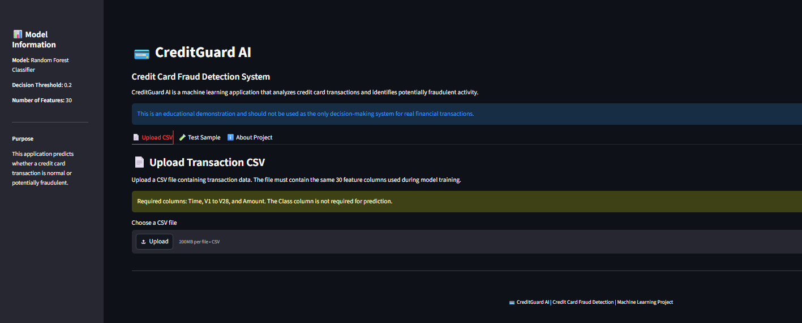
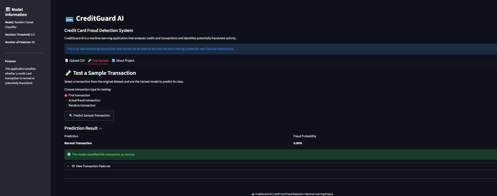
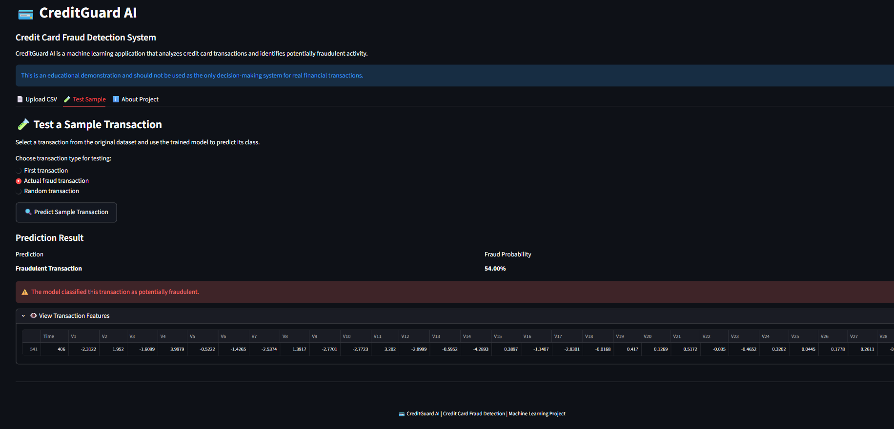
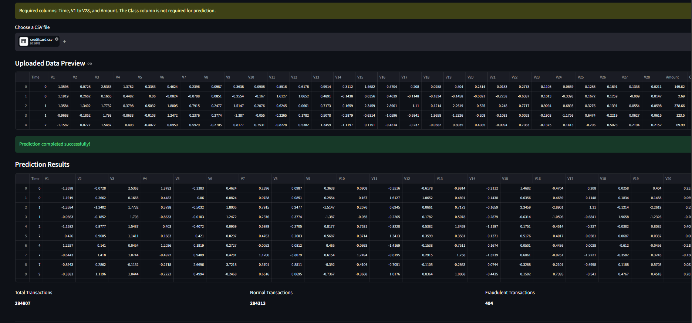

# 💳 CreditGuard AI

## Credit Card Fraud Detection System

CreditGuard AI is a machine learning-based web application that detects potentially fraudulent credit card transactions using a Random Forest Classifier.

The application provides transaction prediction, fraud probability, CSV batch prediction, and downloadable prediction results.

## Features

- Credit card fraud detection
- Random Forest classification
- Fraud probability estimation
- Adjustable decision threshold
- Individual sample prediction
- CSV batch prediction
- Downloadable prediction results
- Streamlit web interface

## Technologies Used

- Python
- Pandas
- NumPy
- Scikit-learn
- Joblib
- Streamlit
- Matplotlib

## Dataset

The project uses the Credit Card Fraud Detection dataset containing anonymized transaction features.

The input features include:

- Time
- V1 to V28
- Amount

The target column is:

- Class

Where:

- 0 = Normal transaction
- 1 = Fraudulent transaction

## Machine Learning Model

A Random Forest Classifier was trained to classify transactions as normal or fraudulent.

The dataset is highly imbalanced, so class imbalance handling and suitable evaluation metrics were considered.

## Evaluation Metrics

The model was evaluated using:

- Precision
- Recall
- F1-score
- ROC-AUC
- PR-AUC
- Confusion Matrix

## Model Performance

Using the selected decision threshold of 0.20:

- Precision: approximately 0.91
- Recall: approximately 0.78
- F1-score: approximately 0.84

These values are based on the test data and may vary if the model is retrained.

## Project Structure
fraud_detection/
├── app.py
├── fraud_detection.py
├── predict.py
├── requirements.txt
├── README.md
├── fraud_detection_model.pkl
├── fraud_threshold.pkl
├── fraud_features.pkl
└── screenshots/

## Application Screenshots

### Main Application

### Normal Transaction Prediction

### Fraudulent Transaction Prediction

### CSV Upload and Prediction Results

Demo:
https://credit-card-fraud-detection-mmvvu7aats84mjkrgryhqb.streamlit.app/
